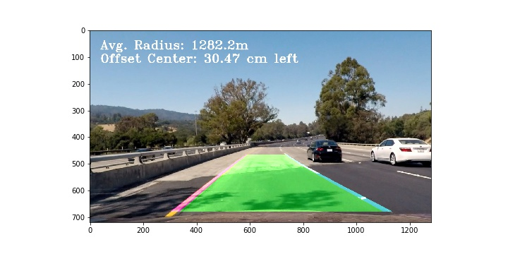

# Advanced Lane Finding Project

The goals / steps of this project are the following:

* Compute the camera calibration matrix and distortion coefficients given a set of chessboard images.
* Apply a distortion correction to raw images.
* Use color transforms, gradients, etc., to create a thresholded binary image.
* Apply a perspective transform to rectify binary image ("birds-eye view").
* Detect lane pixels and fit to find the lane boundary.
* Determine the curvature of the lane and vehicle position with respect to center.
* Warp the detected lane boundaries back onto the original image.
* Output visual display of the lane boundaries and numerical estimation of lane curvature and vehicle position.

---
### Writeup / README

### Camera Calibration

#### 1. Briefly state how you computed the camera matrix and distortion coefficients. Provide an example of a distortion corrected calibration image.

The code for this step is contained in the code cells of the IPython notebook located in `./camera_calibration.ipynb`.

I started by preparing "object points", which will be the (x, y, z) coordinates of the chessboard corners in the world. Here I am assuming the chessboard is fixed on the (x, y) plane at z=0, such that the object points are the same for each calibration image.  Thus, `objp` is just a replicated array of coordinates, and `objpoints` will be appended with a copy of it every time I successfully detect all chessboard corners in a test image.  `imgpoints` will be appended with the (x, y) pixel position of each of the corners in the image plane with each successful chessboard detection.  

I then used the output `objpoints` and `imgpoints` to compute the camera calibration and distortion coefficients using the `cv2.calibrateCamera()` function.  I applied this distortion correction to the test image `calibration4.jpg` using the `cv2.undistort()` function and obtained this result: 


 
 

### Pipeline (single images)

#### 1. Provide an example of a distortion-corrected image.

Now that we have calculated the distortion coefficients, we can use them to undistort images by using the `cv2.undistort()` function. 

Applied to a real world image the effect can be best seen at the right margin looking at the white car. 
Here is an example:  
 
 


#### 2. Describe how (and identify where in your code) you used color transforms, gradients or other methods to create a thresholded binary image.  Provide an example of a binary image result.

I tried all methods introduced in this course. I started with gradients and it's important to convert the color space from RGB to gray. 

I tested thresholds on the magnitude of the gradients, but the lanes couldn't be identified well:

Then I tested thresholds on the direction of the gradient, the result was very noisy.

The combination of both was better:

Then I tried thresholds on different color channels. One of the best combinations was the Red-Channel of RGB nd the S Channel of HLS. In combination with the gradient magnitude and direction I got this result which was quite good:


Doing more research I came over to the Lab color space. In combination of gradients, H**L**S and La**b** Channels The result was nearly the same as before.  


Thne I tried the S channel of HLS and b-Channel of Lab without gradients and got a better, brighter result:


**Finally I decided to leave the Sobel Tranformation away and focus on just L-Channel of HLS and Lab b-channel:**


#### 3. Describe how (and identify where in your code) you performed a perspective transform and provide an example of a transformed image.

The code for my perspective transform includes a function called `warp()` in the file `lane_finding.ipynb`.
```python 
def warp(img, M=M):   
    M, Minv = get_warp_parameters()
    return cv2.warpPerspective(img, M, (1280,720), flags=cv2.INTER_LINEAR)
```

The `warp()` function takes as inputs an image (`img`) and calls the fuction `get_warp_parameters()` to get based on a source and destination rectangle the transformation matrix.  
I chosed to hardcode the source and destination points in the following manner by reading out the pixels on an image of a straight line road test image:

```python
def get_warp_parameters():
    # Helper function to calculate transformation matrix    
    src = np.float32([(575,465), (710,465),  (260,680),  (1050,680)])    
    dst = np.float32([(450,0), (830,0), (450,720), (830,720)])
    
    M = cv2.getPerspectiveTransform(src, dst)
    Minv = cv2.getPerspectiveTransform(dst, src)
    return M, Minv
```


I verified that my perspective transform was working as expected by drawing the `src` and `dst` points onto a test image and its warped counterpart to verify that the lines appear parallel in the warped image.

This picture shows first warping the image and then applying the color threshold filter:


Then I tried applying the color threshold filter first and then to warp the image. This gave better results than the other way around.

This method worked better, so I stayed with this method.


#### 4. Describe how (and identify where in your code) you identified lane-line pixels and fit their positions with a polynomial?

I calculated a histogram and it clearly shows that there are 3 lines, the left and middle line which represent the boundary of our lane and a third line which is the boundary of the right lane.
```python
def plotHistogram(img):
    histogram = np.sum(img[img.shape[0]//2:,:], axis=0)        
```


In the function `def sliding_window(img):` I used the x values from the histogram as starting points for the calculation. In contrast to the sample code of the lecture 33 we have now 2 lanes instead of 1, so we have to divide by 2 again to get the middle of the lane.
Then the silding windows technique is applied by shifting a windows with 10 lines and 80 px width per window. If more than 40 pixels are found in a window, it is marked as "good". If another window in the further processing exceeds this number of found pixels it is the new best fit per line.


For the next images we can use a shortcut in finding the lanes by taking the values from the old image and search the line now in the near of the old values. We are using the function `def previous_fit(binary_warped, left_fit_prev, right_fit_prev):`


#### 5. Describe how (and identify where in your code) you calculated the radius of curvature of the lane and the position of the vehicle with respect to center.

In reference to Lesson 35 - "Measuring Curvature" I used the function 
`def get_radius_and_offset(bin_img, l_fit, r_fit, l_lane_inds, r_lane_inds):`
to calculate the radius and the offset.
I set the parameters as follows:
```python 
ym_per_pix = 30/720  # meters per pixel in y dimension , 720 px = height of the testimages
xm_per_pix = 3.7/380 # meters per pixel in x dimension  380 px = distance in warped testimage inside 1 lane
```

#### 6. Provide an example image of your result plotted back down onto the road such that the lane area is identified clearly.

In the same python notebook I implemented this step in the function `draw_lane()`. 

```python 
def draw_lane(img, warped, left_fit, right_fit, Minv): 
```

Here is an example of my result on a test image:


---

### Pipeline (video)

#### 1. Provide a link to your final video output.  Your pipeline should perform reasonably well on the entire project video (wobbly lines are ok but no catastrophic failures that would cause the car to drive off the road!).

The video is generated by processing all frames successively. I tested my preprocessing pipeline on all test images.
The pipeline can be found in the function
```python
	def preprocess_image(img, debug=False):
```
The pipeline was reduced to the following essential functions:
1. undistort the image
2. warp the image to birds eye perspective
3. apply color thresholds for H **L** S and La **b** channels
4. return a binary image


#### Video Output Preview:

#### Here's a [link to my project video result](project_video_output.mp4)

#### Here's a [link to my challenge video result](challenge_video_output.mp4)


---

### Discussion

#### 1. Briefly discuss any problems / issues you faced in your implementation of this project.  Where will your pipeline likely fail?  What could you do to make it more robust?

The pipeline works well on the normal project video and on the challenge video. The challenge was to find the lines when the light conditions varies strongly. The right choice of color transforms was essential.

The pipeline did'nt work for the harder challenge video. The reason lies in the S-Curves. It's difficult to find a polynomium to fit. An approach might be to use polynomiums of higher order. Also splitting the image into different parts might be helpful. This way the parameters for color transformation could be set separatetly.  
Other reasons are the very sharp curves. The sliding windows move to top to search for the next part of the lane, but  they should search more sideways in this case. 


